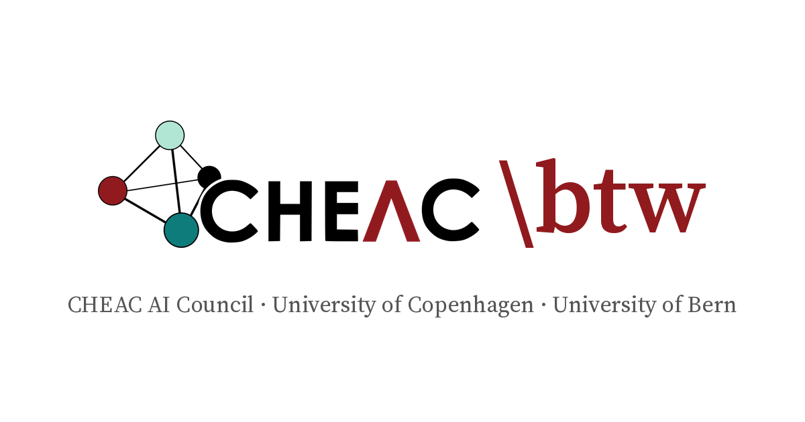

<p align="center">
  <a href="https://cheac-ai.github.io">
    
  </a>
</p>

<p align="center">
  <b>The living document of the CHEAC AI Council</b><br>
  Center for High Entropy Alloy Catalysis · University of Copenhagen · University of Bern
</p>

<p align="center">
  <a href="https://cheac-ai.github.io"><b>cheac-ai.github.io</b></a>
</p>

---

**CHEAC \btw** collects guidance, best practices, and shared experience on using artificial intelligence in research at CHEAC. The council's role is advisory.

The site has these sections:

| Section | Content |
|---|---|
| [Best Practices](https://cheac-ai.github.io/practices/) | How to use AI tools well in daily research |
| [Guidelines](https://cheac-ai.github.io/guidelines/) | KU guidelines on AI use and the CHEAC Data Management Plan |
| [AI in research](https://cheac-ai.github.io/ai-in-research/) | How AI changes the way we do chemistry and materials science |
| [Transparency](https://cheac-ai.github.io/transparency/) | How to report AI use in manuscripts, figures, code, and teaching |
| [AI News](https://cheac-ai.github.io/news/) | New tools, policies, and papers worth knowing about |
| [Suggestion box](https://cheac-ai.github.io/suggestions/) | Topics the council should discuss next |

## Suggesting a topic

Open a [topic suggestion](https://github.com/cheac-ai/cheac-ai.github.io/issues/new?template=topic-suggestion.yml). The form asks for a topic, what should be discussed, and where it could go. Every open suggestion appears in the [Suggestion box](https://cheac-ai.github.io/suggestions/) shortly after, and comments on the issue continue the discussion. Closing the issue removes it from the list.

## Contributing

Everyone at CHEAC can contribute.

- **No GitHub account:** email text and figures to the council editor at [ts@chem.ku.dk](mailto:ts@chem.ku.dk).
- **With GitHub:** add a `.qmd` page to the folder of its section (`practices/`, `guidelines/`, `ai-in-research/`, `transparency/`, or `news/`) and open a pull request.

Section lists, the navbar, and the *Most recent* list on the front page update automatically from each page's header (`title`, `author`, `date`, `description`, optional `image`). The [contributing page](https://cheac-ai.github.io/contributing/contributing.html) has the full template.

## Building locally

The site is built with [Quarto](https://quarto.org/docs/get-started/). From the repository folder:

```bash
quarto preview --port 4321
```

The site opens at `http://localhost:4321` and reloads on save. Every push to `main` publishes the site through GitHub Actions, and so does every change to a suggestion issue.

## License

[MIT](LICENSE)
